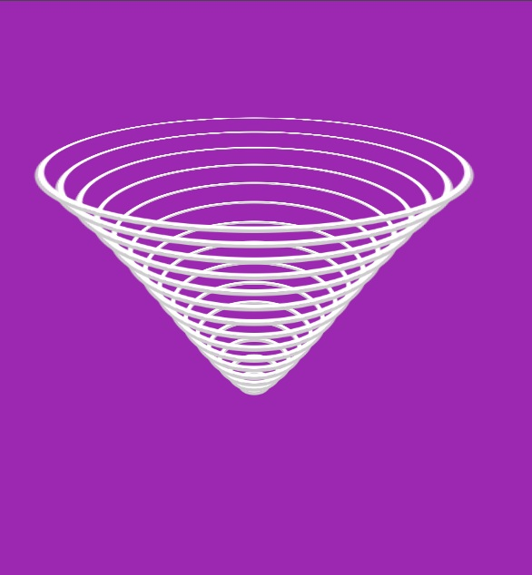
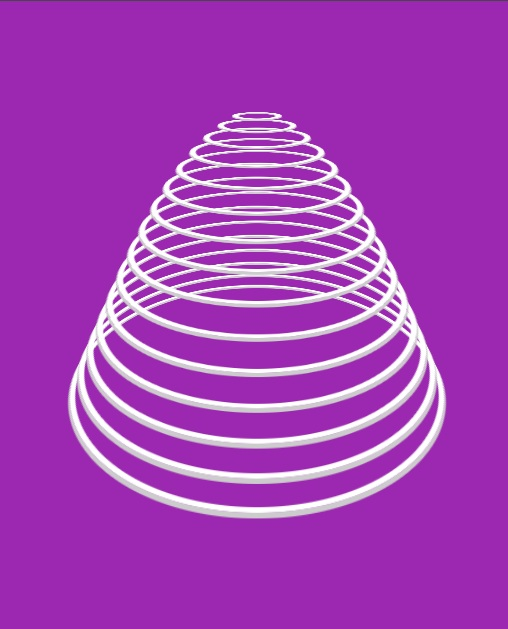

# 🌊 CSS 3D Wavy Circle Loader Animation

<p align="center">
  
</p>

---

### 🌟 Overview
Welcome to the **CSS 3D Wavy Circle Loader**! This project showcases the power of **Modern CSS3** combined with minimal **JavaScript** to create a mesmerizing 3D depth effect. It features 15 concentric circles moving in a wave-like motion within a 3D perspective.

[📺 Watch Live Demo](https://juniordevelopper.github.io/CSS-3D-Wavy-Circle-Loader-Animation-Effects/)

---

### 🎨 Visual Preview

| 🖼️ Static Perspective | 🌀 Motion Effect |
| :---: | :---: |
|  |  |
| *High-angle view of the 3D structure* | *Shadow and depth details* |

---

### 🚀 Key Features
- 💎 **Pure CSS 3D Engine:** Uses `preserve-3d` and `rotateX` for realistic depth.
- ⚡ **Optimized Code:** 15 circles are dynamically generated using **JavaScript** to keep the HTML file clean.
- 🌊 **Wave Physics:** Smooth `translateZ` animations with calculated `animation-delay`.
- 📱 **Fully Responsive:** Centered with Flexbox and scales perfectly on all screen sizes.

---

### 📂 File Structure
```bash
├── index.html   # HTML Structure
├── main.css     # 3D Styles & Keyframes
├── main.js      # Circle Generator Logic
├── assets       # Images and gif of the project
